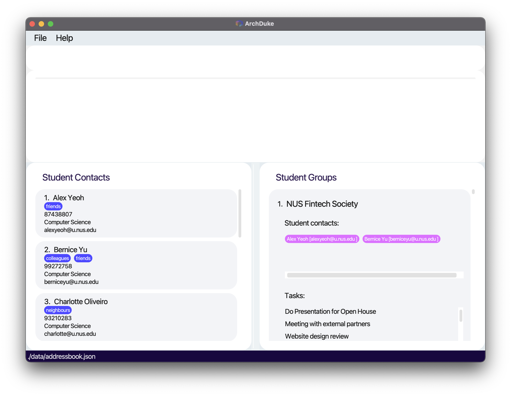
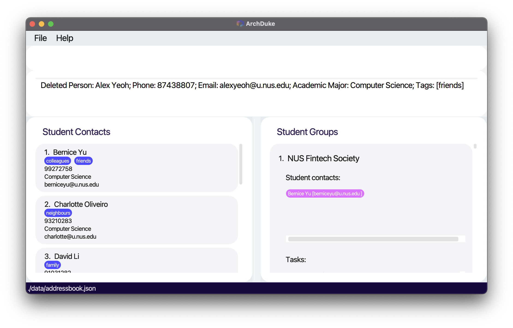
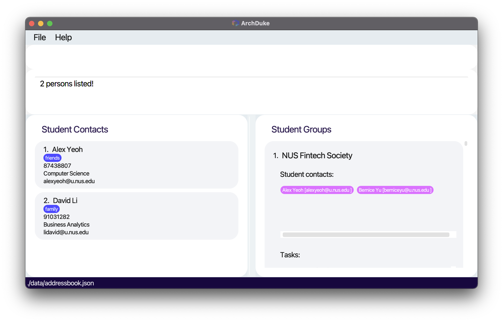
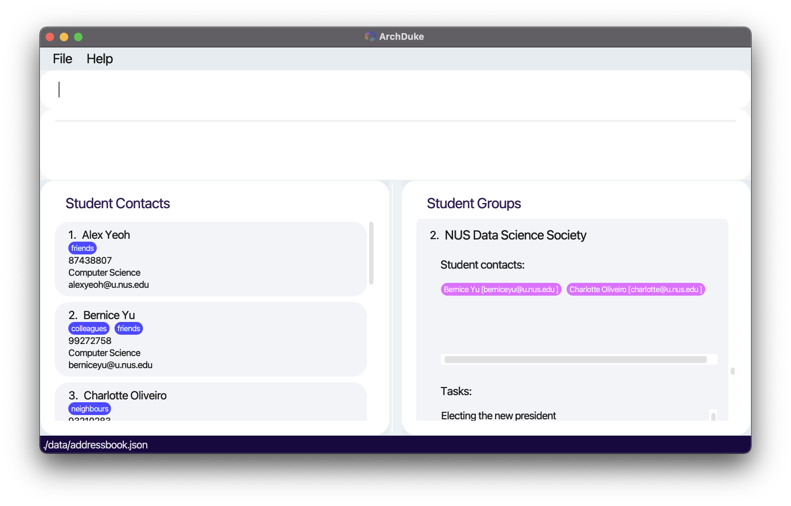
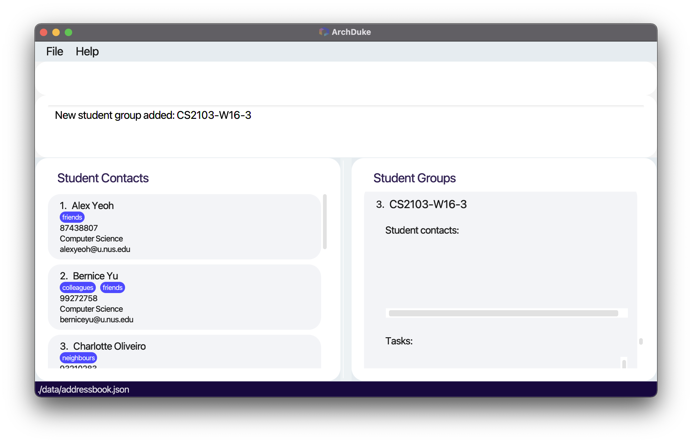
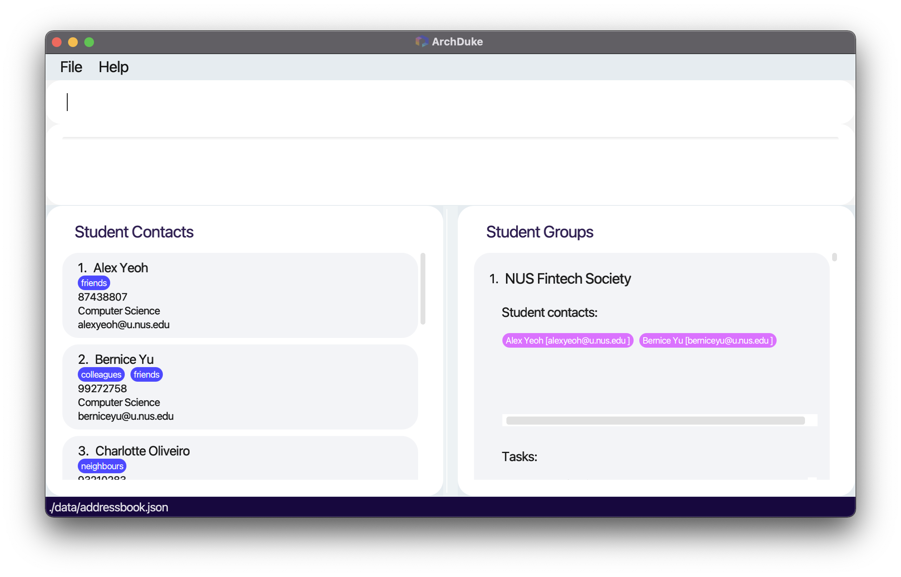
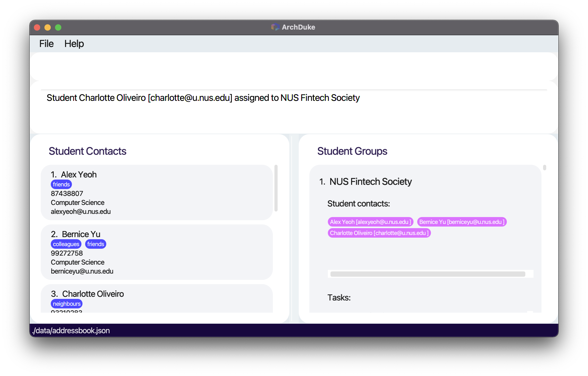
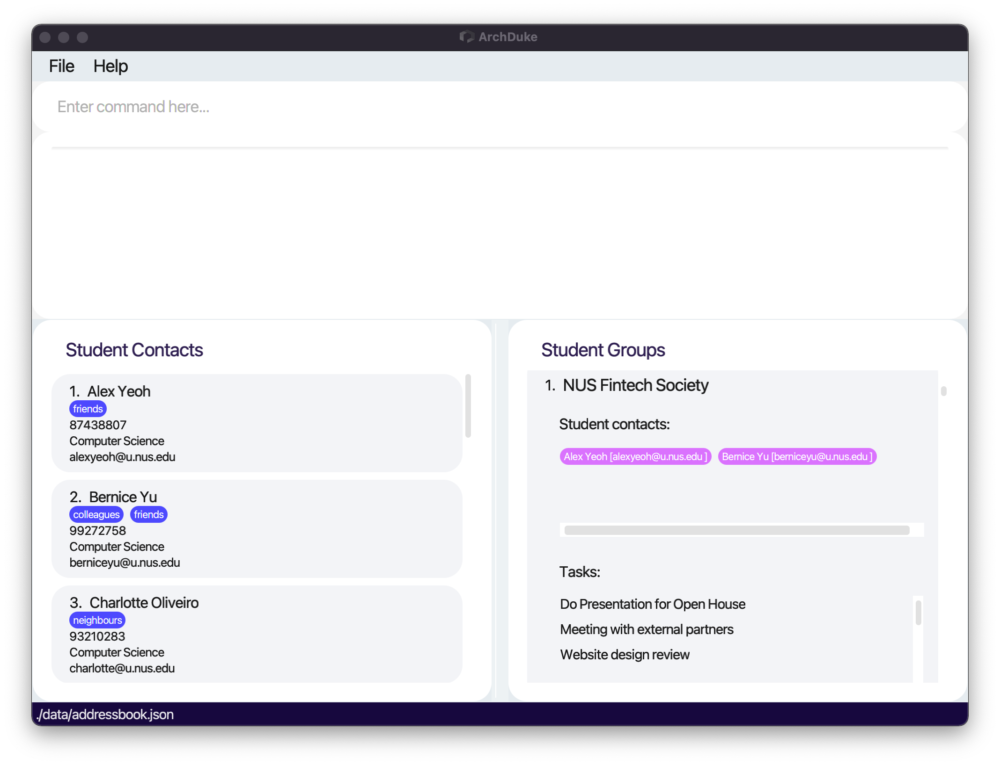
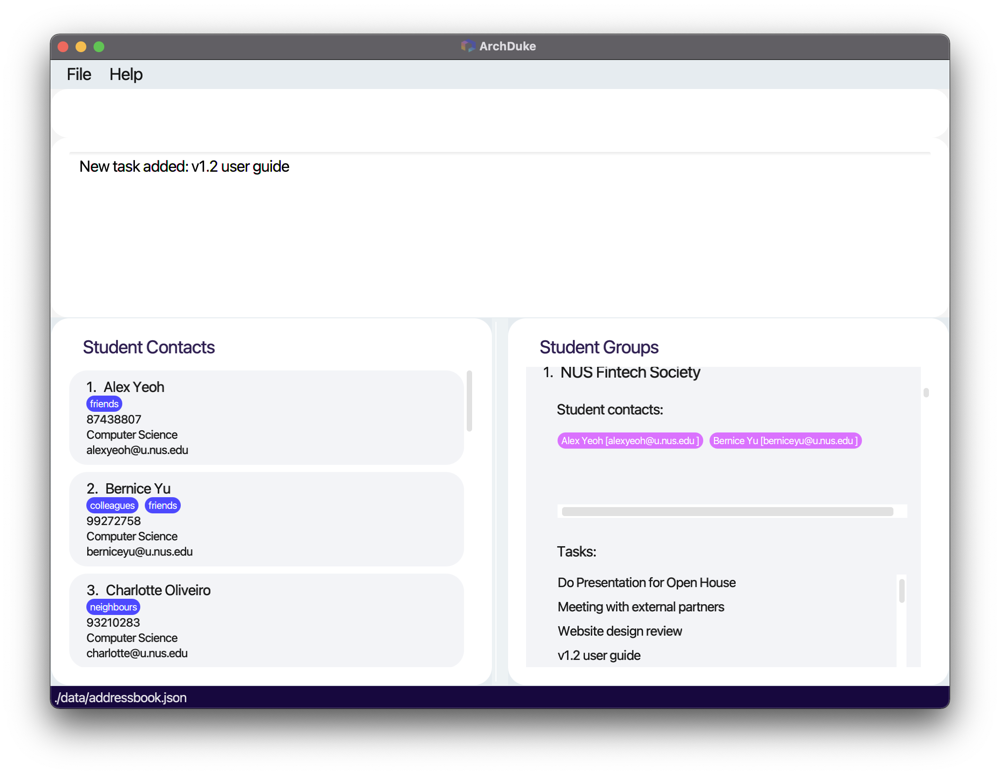
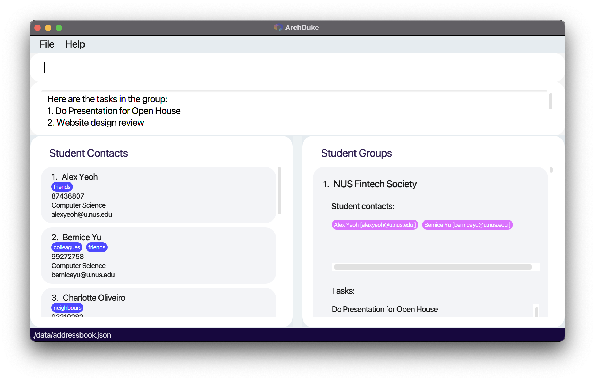

ArchDuke is an **application to help students manage student contacts, groups, and group tasks, optimized for use via a Command Line Interface** (CLI) while still having the benefits of a Graphical User Interface (GUI). 
This product is also optimized for students to **update and keep track of members of student groups and tasks in each group**.
If you can type fast, ArchDuke can get your contact management, group management, and task management done faster than traditional GUI apps.

* Table of Contents
{:toc}

--------------------------------------------------------------------------------------------------------------------

# Quick start

1. Ensure you have Java `11` or above installed in your Computer.

1. Download the latest `archduke.jar` from [here](https://github.com/AY2122S2-CS2103-W16-3/tp/releases).

1. Copy the file to the folder you want to use as the _home folder_ for your ArchDuke.

1. Double-click the file to start the app. The GUI similar to the below should appear in a few seconds. Note how the app contains some sample data. 
   

1. Type the command in the command box and press Enter to execute it. e.g. typing **`help`** and pressing Enter will open the help window. 
   Some example commands you can try:

   * **`list`** : Lists all student contacts.

   * **`add`**`n/John Doe p/12345678 e/johndoe@u.nus.edu a/Computer Science t/friends` : Adds a contact named `John Doe` to ArchDuke.

   * **`clear`** : Deletes all entries in ArchDuke.

   * **`exit`** : Exits the app.

1. Refer to the [Features](#features) below for details of each command.

--------------------------------------------------------------------------------------------------------------------

# Features

**:information_source: Notes about the command format:** 

* Words in `UPPER_CASE` are the parameters to be supplied by the user. 
  e.g. in `add n/NAME`, `NAME` is a parameter which can be used as `add n/John Doe`.

* Items in square brackets are optional. 
  e.g `n/NAME [t/TAG]` can be used as `n/John Doe t/friend` or as `n/John Doe`.

* Items with `…`​ after them can be used multiple times including zero times. 
  e.g. `[t/TAG]…​` can be used as ` ` (i.e. 0 times), `t/friend`, `t/friend t/family` etc.

* Parameters can be in any order. 
  e.g. if the command specifies `n/NAME p/PHONE_NUMBER`, `p/PHONE_NUMBER n/NAME` is also acceptable.

* If a parameter is expected only once in the command but you specified it multiple times, only the last occurrence of the parameter will be taken. 
  e.g. if you specify `p/12341234 p/56785678`, only `p/56785678` will be taken.

* Extraneous parameters for commands that do not take in parameters (such as `help`, `list`, `exit` and `clear`) will be ignored. 
  e.g. if the command specifies `help 123`, it will be interpreted as `help`.

## General Features

### Viewing help : `help`

Shows a message explaning how to access the help page and shows the format of all commands.

Format: `help`

### Listing all persons : `list`

Shows a list of all student contacts in ArchDuke. This command is often used to return back 
to the student contact list.

Format: `list`

### Clearing all entries: `clear`

Clears all entries from ArchDuke.

Format: `clear`

### Exiting the program : `exit`

Exits the program.

Format: `exit`

### Saving the data

ArchDuke data are saved in the hard disk automatically after any command that changes the data. 
There is no need to save manually.

## Student Contact Management

### Add student contact information: `add`

Adds a student contact information to ArchDuke. `add` must be followed by the student’s `NAME`, 
`PHONE_NUMBER`, `EMAIL`, and `ACADEMIC_MAJOR`. `TAG` is optional. 

**:information_source: Note:** 

A student contact can only be added if it **has yet to exist** in ArchDuke. The student contact 
is uniquely identified by his `NAME` with **no regards to case sensitivity**. E.g. `John Doe` would be the 
same person as `john doe`

Format: `add n/NAME p/PHONE_NUMBER e/EMAIL a/ACADEMIC MAJOR [t/TAG]`

**:information_source: Tip:** 

A student contact can have any number of tags (including 0)

Example: 

* `add n/John Doe p/12345678 e/johndoe@u.nus.edu a/Computer Science t/friends`
* `add n/Joel Lee p/87654321 e/joellee@u.nus.edu a/Information Systems`

Expected outcome:

* Student’s contact information is visible in ArchDuke and added to student contact list.

### Delete student contact information: `delete`

Deletes a student contact information at the specified `INDEX` from ArchDuke.
The `INDEX` refers to the index number shown in the **currently displayed** student contact list. 
The `INDEX` **must be a positive integer**. The deleted student contact would also be 
deleted from all his currently assigned groups.

Format: `delete INDEX`

Example: 

* `delete 1`
* `list` followed by `delete 2` deletes the second person in the current list from ArchDuke.
* `find n/Bernice` followed by `delete 1` deletes the first person in the current resulting list of the `find` command.

Expected outcome:

* The student contact is removed from ArchDuke. The student contact is also removed from all previously assigned groups.

Before deleting Alex Yeoh at index 1:

After deleting Alex Yeoh previously at index 1:

### Locating student contacts by attributes: `find`

Locates all student contact in ArchDuke based on attributes that matches the given keywords. 
* The attributes supported are: `n/NAME`, `p/PHONE_NUMER`, `e/EMAIL`, `a/ACADEMIC_MAJOR`, `t/TAG`
* The specified keywords are **case-insensitive**. 
* The attributes could be accessed by adding prefixes before the keywords.
* The result must match the **exact wording**, partial words will not match (e.g. `n/Dav` will not match the student contact
`David` or `David Li`).
* The command will list out all student contacts that matches the keyword.
  * `find n/Alex` would match with `Alex Yeoh` and `Alex Yu`
  * `find n/Alex Yeoh` would match with `Alex Yeoh` and `Alex Yu`
  * `find n/Alex Yu` would match with `Alex Yeoh`, `Alex Yu`, and `Bernice Yu`
  

* The attributes supported **multiple findings** at the same time are `n/NAME`, `a/ACADEMIC_MAJOR`, and `t/TAG`
  * `find n/Alex David` is possible and would show two results as `Alex Yeoh` and `David Li`, assuming that these are the only matching contacts.
  * `find a/Computer Science Business` is possible and would show contacts that has the following major: `Computer Science`, `Business`, `Business Analytics`
  , assuming that these majors are the exhaustive majors in the student contacts.
  * `find t/friends colleagues` is possible and would show contacts that has the at least one of the 2 tags: `friends` and `colleagues`

* The attributes **not supported multiple findings** at the same time are `p/PHONE_NUMBER` and `e/EMAIL`
  * `find e/example@u.nus.edu student@u.nus.edu` is not possible as `find` command only supports finding one `EMAIL` at a time (e.g. `find e/example@u.nus.edu` or `find e/student@u.nus.edu`)
  * `find p/12345678 87654321` is not possible as `find` command only supports finding one `PHONE_NUMBER` at a time (e.g. `find p/12345678` or `find p/87654321`)

Format: `find PREFIX/KEYWORD [MORE_KEYWORDS]` for these `PREFIX`: `n/`, `a/`, `t/`

Format: `find PREFIX/KEYWORD` for these `PREFIX`: `e/`, `p/`

Example:

* `find n/Alex David` or `find n/Alex`
* `find p/98765432`
* `find e/example@u.nus.edu`
* `find a/Computer Science` or `find a/Security`
* `find t/friends colleagues` or `find t/colleagues`

Expected outcome:

* Lists all student contacts that match with those attributes and displays the number of student contacts that 
match those keywords.

Find result for the command `find n/alex david`:

## Student Group Management

### Create a group: `addgroup`

Creates a group in ArchDuke.

**:information_source: Note:** 

A group can only be added if it **has yet to exist** in ArchDuke. The group
is uniquely identified by a `GROUP_NAME` with **no regards to case sensitivity**. E.g. `NUS` would be the
same group as `Nus` and `nus`

Format: `addgroup g/GROUP_NAME`

Example: 

* `addgroup g/CS2103-W16-3`

Expected outcome: 

* Creates a group with the name CS2103-W16-3 to ArchDuke.

Before adding the group. Note that NUS Data Science Society is currently the last group in the list:

After adding the group CS2103-W16-3:

### Delete a group: `delgroup`

Deletes a group from ArchDuke. The group must **already exist** in ArchDuke.

Format: `delgroup g/GROUP_NAME`

Example: 

* `delgroup g/CS2103-W16-3`

Expected outcome: 

* Deletes the group with the name CS2103-W16-3 from ArchDuke.

### Assign a student to a group: `assign`

Assigns a student to an existing group in ArchDuke. `assign` is followed by the `INDEX` at which the student is 
in the **currently displayed** ArchDuke student contact list and the `GROUP_NAME` in which the student would be assigned. 
The group must **already exist** in ArchDuke, and the `INDEX` must be a **positive integer**. The student contact **must 
has yet to be currently assigned** to the group. 

Format: `assign INDEX g/GROUP_NAME`

* Assigns the student at index `INDEX` to the group called `GROUP_NAME`

Example:

* `assign 3 g/NUS Fintech Society`

Expected outcome:

* Assigns the specified student to the specified group.

Before assigning Charlotte at index 3 to the group NUS Fintech Society:

After assigning:

### Deassign a student from a group: `deassign`

Deassigns a student from an existing group in ArchDuke. `deassign` is followed by the `INDEX` at which the student
is in the **currently displayed** ArchDuke student contact list and the `GROUP_NAME` in which the student would be deassigned. 
The group must **already exist** in ArchDuke, and the index must be a **positive integer**. The student contact **must have 
currently been assigned** to the group.  

Format: `deassign INDEX g/GROUP_NAME`

* Deassigns the student at index `INDEX` from the group called `GROUP_NAME`

Example:

* `deassign 1 g/NUS Fintech Society`

Expected outcome:

* Deassigns the specified student from the specified group.

### View student contacts in an existing group: `viewcontact`

Displays the student contacts from the specified group. `viewcontact` must be followed by a `GROUP_NAME`.
The group **must already exist** in ArchDuke.

Format: `viewcontact g/GROUP_NAME`

* Views all student contacts in the group called `GROUP_NAME`

Example:

* `viewcontact g/NUS Fintech Society`

Expected outcome:

* Displays all the student contacts from the specified group.

Result of viewing contact in a group:

## Student Group Task Management

### Add a task in a group: `addtask`

Adds a task to the specified group. `addtask` must be followed by a `TASK_NAME` and a `GROUP_NAME`. 
The group must **already exist** in ArchDuke. The task **must not already exist** in the specified group ArchDuke.

**:information_source: Note:** 

A task can only be added if it **has yet to exist** in the particular group. The task
is uniquely identified by a `TASK_NAME` with **no regards to case sensitivity**. E.g. `MEETING` would be the
same task as `Meeting` and `meeting`

Format: `addtask task/TASK_NAME g/GROUP_NAME`

* Adds the task called `TASK_NAME` to the group called `GROUP_NAME`

Example:

* `addtask task/v1.2 user guide g/NUS Fintech Society`

Expected outcome:

* Adds the specified task to the specified group. The task appears inside the group.

Before add task v1.2 user guide to the group NUS Fintech Society:

After add task:

### Delete a task in a group: `deltask`

Deletes a task from the specified group. `deltask` must be followed by a `TASK_NAME` and a `GROUP_NAME`. 
The group must **already exist** in ArchDuke. The task must **already exist** in the particular group.

Format: `deltask task/TASK_NAME g/GROUP_NAME`

* Deletes the task called `TASK_NAME` from the group called `GROUP_NAME`

Example: 

* `deltask task/v1.2 user guide g/NUS Fintech Society`

Expected outcome:

* Deletes the specified task from the specified group.

### Displays the tasks in a group: `viewtask`

Displays the tasks from the specified group. `viewtask` must be followed by a `GROUP_NAME`. 
The group must **already exist** in ArchDuke.

Format: `viewtask g/GROUP_NAME`

* Views all task in the group called `GROUP_NAME`

Example:

* `viewtask g/NUS Fintech Society`

Expected outcome:

* Displays all the tasks from the specified group.

Result of viewing task in the group NUS Fintech Society:

--------------------------------------------------------------------------------------------------------------------

## FAQ

**Q**: How do I transfer my data to another Computer? 
**A**: Install the app in the other computer and overwrite the empty data file it creates with the file 
that contains the data of your previous ArchDuke home folder.

**Q**: When and why does ArchDuke use sample data? 
**A**: ArchDuke uses sample data when the application is first launched. The purpose of the sample data is to 
let the new user experiment with the data while getting familiar with ArchDuke. If you wish to start using ArchDuke
fresh from the start, you could use the `clear` command to clear all the sample data.

**Q**: What is an academic major? 
**A**: An academic major is simply the major that the student is studying in university.

**Q**: What does an index refer to? 
**A**: An index is simply the number in front of the student contact's name or the group's name. It specifies the order 
in which the student contact or the group appears in the list.

--------------------------------------------------------------------------------------------------------------------

## Command summary

### General features

Action | Format, Examples
--------|------------------
**View help** | `help`
**List all student contacts** | `list`
**Find name** | `find KEYWORD [MORE_KEYWORDS]`  e.g., `find n/James Jake`
**Find academic major** | `find KEYWORD [MORE_KEYWORDS]`  e.g., `find a/Computer Science`
**Find tag** | `find KEYWORD [MORE_KEYWORDS]`  e.g., `find t/friends colleagues`
**Find phone number** | `find KEYWORD`  e.g., `find p/12345678`
**Find email** | `find KEYWORD`  e.g., `find e/example@u.nus.edu`
**Clear entries** | `clear`
**Exit** | `exit`

### Student contact management

Action | Format, Examples
--------|------------------
**Add student contact information** | `add n/NAME p/PHONE_NUMBER e/EMAIL a/ACADEMIC_MAJOR [t/TAG]`   e.g., `add n/John Doe p/12345678 e/johndoe@u.nus.edu a/Computer Science t/friends`
**Delete student contact information** | `delete INDEX`   e.g., `delete 1`
**Display the student contacts in a group** | `viewcontact g/GROUP_NAME`   e.g., `viewcontact g/CS2103-W16-3`

### Student group management

Action | Format, Examples
--------|------------------
**Create a group** | `addgroup g/GROUP_NAME`  e.g., `addgroup g/CS2103-W16-3`
**Delete a group** | `delgroup g/GROUP_NAME`  e.g.,`delgroup g/CS2103-W16-3`
**Assign a student to a group** | `assign INDEX g/GROUP_NAME`  e.g.,`assign 1 g/CS2103-W16-3`
**Deassign a student from a group** | `deassign INDEX g/GROUP_NAME`  e.g.,`deassign 1 g/CS2103-W16-3`
**Display student contacts in a group** | `viewcontact g/GROUP_NAME`  e.g.,`viewcontact g/CS2103-W16-3`

### Student group task management

Action | Format, Examples
--------|------------------
**Add a task in a group** | `addtask task/TASK_NAME g/GROUP_NAME`  e.g., `addtask task/v1.2 user guide g/CS2103-W16-3`
**Delete a task in a group** | `deltask task/TASK_NAME g/GROUP_NAME`  e.g.,`deltask task/v1.2 user guide g/CS2103-W16-3`
**Display the tasks in a group** | `viewtask g/GROUP_NAME`  e.g.,`viewtask g/CS2103-W16-3`
